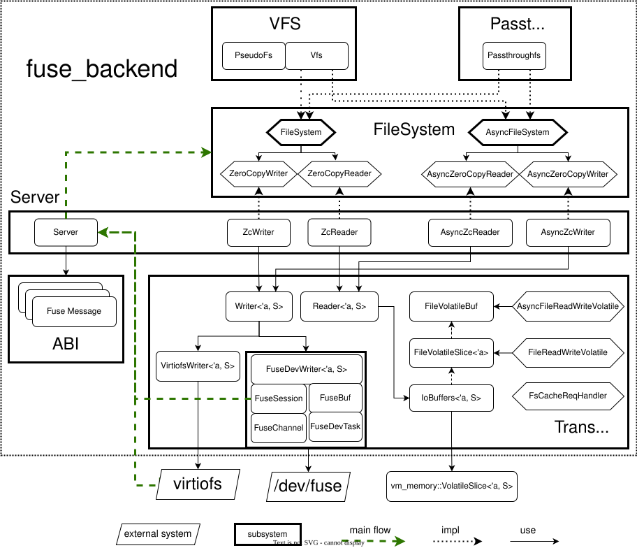

# Rust FUSE library for server, virtio-fs and vhost-user-fs


[](https://crates.io/crates/fuse-backend-rs)

## Design

The fuse-backend-rs crate is an rust library to implement Fuse daemons based on the
[Linux FUSE device (/dev/fuse)](https://www.kernel.org/doc/html/latest/filesystems/fuse.html)
or the [virtiofs](https://stefanha.github.io/virtio/virtio-fs.html#x1-41500011) draft specification.

Linux FUSE is an userspace filesystem framework, and the /dev/fuse device node is the interface for
userspace filesystem daemons to communicate with the in-kernel fuse driver.

And the virito-fs specification extends the FUSE framework into the virtualization world, which uses
the Virtio protocol to transfer FUSE requests and responses between the Fuse client and server.
With virtio-fs, the Fuse client runs within the guest kernel and the Fuse server runs on the host
userspace or hardware.

So the fuse-rs crate is a library to communicate with the Linux FUSE clients, which includes:
- ABI layer, which defines all data structures shared between linux Fuse framework and Fuse daemons.
- API layer, defines the interfaces for Fuse daemons to implement a userspace file system.
- Transport layer, which supports both the Linux Fuse device and virtio-fs protocol.
- VFS/pseudo_fs, an abstraction layer to support multiple file systems by a single virtio-fs device.
- A sample passthrough file system implementation, which passes through files from daemons to clients. 



## Crate layout

The library is a Cargo workspace. The `fuse-backend-rs` crate at the root is a
thin facade that re-exports the sub-crates under `crates/`, so every historical
`fuse_backend_rs::{abi, api, buffer, common, transport, passthrough, overlayfs}`
path and every historical cargo feature (`fusedev`, `virtiofs`, `vhost-user-fs`,
`async-io`, `persist`, `fuse-t`, `fusedev-uring`) keeps resolving unchanged.

| Crate | Contents |
| --- | --- |
| [`fuse-backend-core`](crates/fuse-backend-core) | The transport-neutral layers: Fuse ABI, API/server, VFS, buffers and common utilities. |
| [`fuse-backend-fusedev`](crates/fuse-backend-fusedev) | The /dev/fuse transport, plus FUSE-over-io_uring and the macFUSE/fuse-t transports. |
| [`fuse-backend-virtiofs`](crates/fuse-backend-virtiofs) | The virtio-fs transport, carrying Fuse requests over virtio descriptor chains. |
| [`fuse-backend-passthrough`](crates/fuse-backend-passthrough) | The passthrough filesystem driver (Linux-only). |
| [`fuse-backend-overlayfs`](crates/fuse-backend-overlayfs) | The overlay filesystem driver stacking read-only layers under a writable one (Linux-only). |

Most users should keep depending on the umbrella crate, which bundles each
transport with the drivers it has always shipped with:

```toml
[dependencies]
fuse-backend-rs = { git = "https://github.com/cloud-hypervisor/fuse-backend-rs", features = ["fusedev"] }
```

Downstream crates that only need one layer can depend on a sub-crate directly
and skip the rest of the workspace. For example, a filesystem built on the core
ABI/API and the passthrough driver:

```toml
[dependencies]
fuse-backend-core = { git = "https://github.com/cloud-hypervisor/fuse-backend-rs" }
fuse-backend-passthrough = { git = "https://github.com/cloud-hypervisor/fuse-backend-rs" }
```

The sub-crates are not published to crates.io yet, so depend on the git
repository directly for now.

## Async IO (Experimental)

Besides the traditional synchronous IO path, an asynchronous IO path is provided
through the optional `async-io` cargo feature, e.g.:

```toml
[dependencies]
fuse-backend-rs = { git = "https://github.com/cloud-hypervisor/fuse-backend-rs", features = ["fusedev", "async-io"] }
```

The `async-io` feature is not part of a released crate version yet, so depend
on the git repository directly. Please note that the feature is still
**experimental**:
- It depends on [tokio-uring](https://github.com/tokio-rs/tokio-uring) and
  [io_uring](https://kernel.dk/io_uring.pdf), so it's only available on Linux.
  Builds with the feature enabled will fail on other platforms.
- The asynchronous interfaces and behavior may change in future releases.
- The asynchronous handlers of `PassthroughFs` currently relay requests to their
  synchronous counterparts, so the blocking syscalls run in the context of the
  async runtime. A native io_uring based implementation is planned for the future.

To serve requests asynchronously, mount the filesystem through `Vfs` and drive a
`FuseDevTask` (fusedev transport) inside an async runtime, refer to
[tests/async_smoke.rs](tests/async_smoke.rs) for a working example.

## Examples

### Filesystem Drivers
- [Virtual File System](https://github.com/cloud-hypervisor/fuse-backend-rs/tree/master/crates/fuse-backend-core/src/api/vfs)
  for an example of union file system.
- [Pseudo File System](https://github.com/cloud-hypervisor/fuse-backend-rs/blob/master/crates/fuse-backend-core/src/api/pseudo_fs.rs)
  for an example of pseudo file system.
- [Passthrough File System](https://github.com/cloud-hypervisor/fuse-backend-rs/tree/master/crates/fuse-backend-passthrough/src)
  for an example of passthrough(stacked) file system.
- [Registry Accelerated File System](https://github.com/dragonflyoss/image-service/tree/master/rafs)
  for an example of readonly file system for container images.

### Fuse Servers
- [Dragonfly Image Service fusedev Server](https://github.com/dragonflyoss/image-service/blob/master/src/bin/nydusd/fusedev.rs)
for an example of implementing a fuse server based on the
[fuse-backend-rs](https://crates.io/crates/fuse-backend-rs) crate.
- [Dragonfly Image Service vhost-user-fs Server](https://github.com/dragonflyoss/image-service/blob/master/src/bin/nydusd/virtiofs.rs)
  for an example of implementing vhost-user-fs server based on the
  [fuse-backend-rs](https://crates.io/crates/fuse-backend-rs) crate.
  
### Fuse Server and Main Service Loop
A sample fuse server based on the Linux Fuse device (/dev/fuse):

```rust
use fuse_backend_rs::api::{server::Server, Vfs, VfsOptions};
use fuse_backend_rs::transport::fusedev::{FuseSession, FuseChannel};

struct FuseServer {
    server: Arc<Server<Arc<Vfs>>>,
    ch: FuseChannel,
}

impl FuseServer {
    fn svc_loop(&self) -> Result<()> {
      // Given error EBADF, it means kernel has shut down this session.
      let _ebadf = std::io::Error::from_raw_os_error(libc::EBADF);
      loop {
        if let Some((reader, writer)) = self
                .ch
                .get_request()
                .map_err(|_| std::io::Error::from_raw_os_error(libc::EINVAL))?
        {
          if let Err(e) = self.server.handle_message(reader, writer, None, None) {
            match e {
              fuse_backend_rs::Error::EncodeMessage(_ebadf) => {
                break;
              }
              _ => {
                error!("Handling fuse message failed");
                continue;
              }
            }
          }
        } else {
          info!("fuse server exits");
          break;
        }
      }
      Ok(())
    }
}
```

## License
This project is licensed under
- [Apache License](http://www.apache.org/licenses/LICENSE-2.0), Version 2.0
- [BSD-3-Clause License](https://opensource.org/licenses/BSD-3-Clause)
