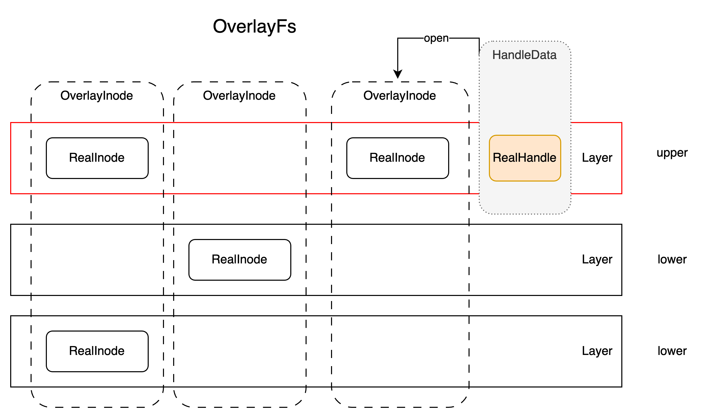
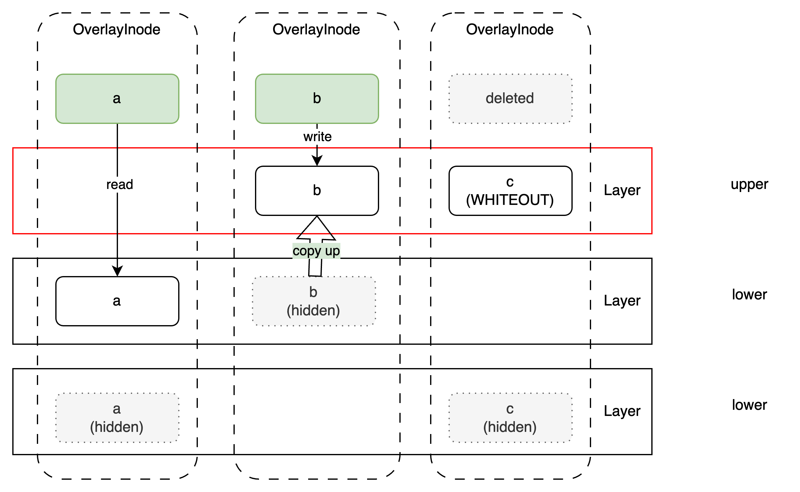
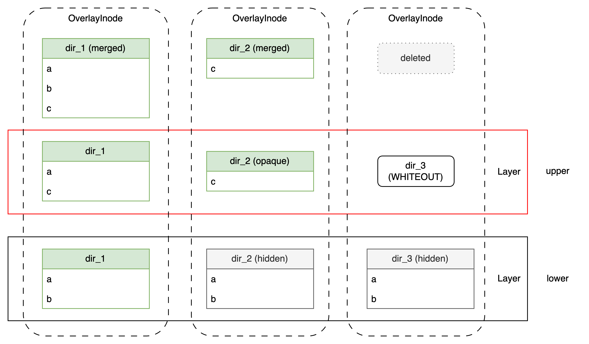

# Architecture of Overlay FS

The implementation of userspace Overlay FS follows [the design of the kernel](https://docs.kernel.org/filesystems/overlayfs.html),
but it is not a direct port. 
There are some differences between the kernel implementation and the userspace implementation due to FUSE limitations,
it's under heavy development to make it more stable and more compatible.

## Basic Struct Definitions

There're some important structs in the implementation of Overlay FS, they are:

* `OverlayFs`: the main struct of the union FS, it's composed of multiple layers, normally one optional writable upper layer and many readonly lower layers.
* `OverlayInode`: inode struct in OverlayFs, one OverlayInode is composed of many `RealInode` in each layer.
* `RealInode`: wrapper for backend `inode` in one single layer.
* `HandleData`: opened file handle in OverlayFs, one OverlayInode reflects to one OverlayInode and one optional `RealHandle` in some layer.
* `RealHandle`: wrapper for backend opened file handle in one single layer.

Also another trait named `Layer` is introducted to represent a single layer in OverlayFs, only filesystems which implement this trait can be used as a layer in OverlayFs.

Relationship between these structs are illustrated in the following figure:

## Non-Directory File

Following kernel Overlay semantics, OverlayFs uses the following rules to handle non-directory files:

* If a file with same name exists in all layers, the topmost file will be choosed, any other files with same name in lower layers will be hidden.
* If a file in lower filesystem is accessed in a way the requires write-access, such as opening for write access, changing some metadata etc., 
the file is first copied from the lower filesystem to the upper filesystem (copy_up).

## Directory

Following kernel Overlay semantics, OverlayFs uses the following rules to handle directories:

* If a directory with same name exists in all layers, the union directory will merge all entries of directory in all layers.
* If a directory is set as opaque, all entries in lower layers will be hidden.
* The copy up logic is similar to non-directory file, any write access to a directory will trigger copy up.

## Whiteout

A whiteout is a special file in OverlayFs, it indicates a deletion of a file or directory in lower layer.
whiteout is device file with major number 0 and minor number 0, 
and the name of whiteout file is the name of file or directory to be deleted.

## Opaque

Opaque is a special flag for directory in OverlayFs, it indicates that all entries of directory in lower layers will be ignored.
Opaque is implemented by setting one of these xattr to 'y':

* `trusted.overlay.opaque`
* `user.overlay.opaque`
* `user.fuseoverlayfs.opaque`

`user.fuseoverlayfs.opaque` is customized flag for our fuse-overlayfs.

